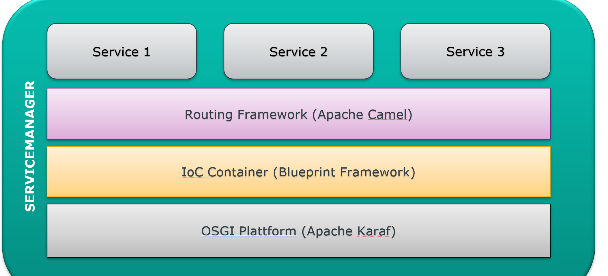
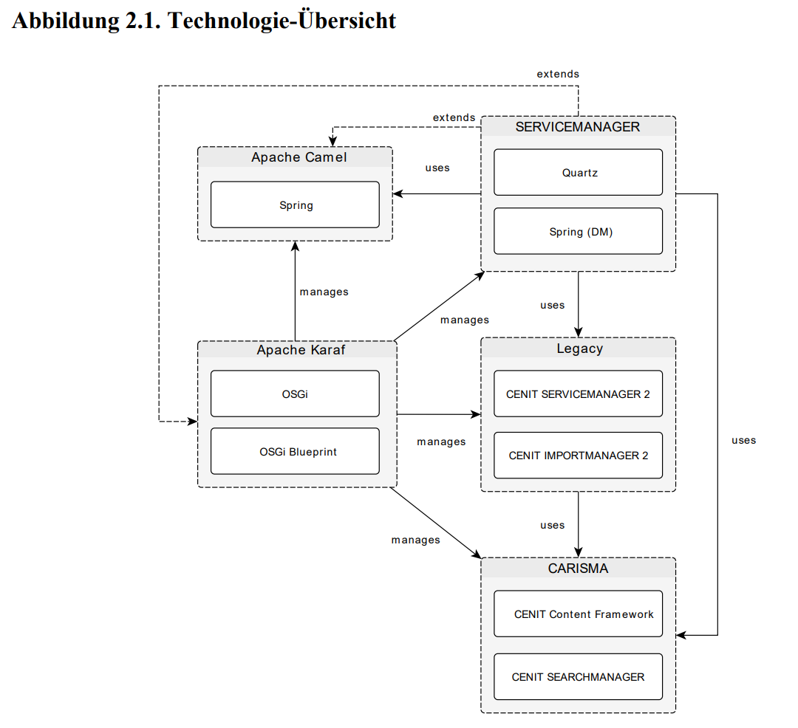
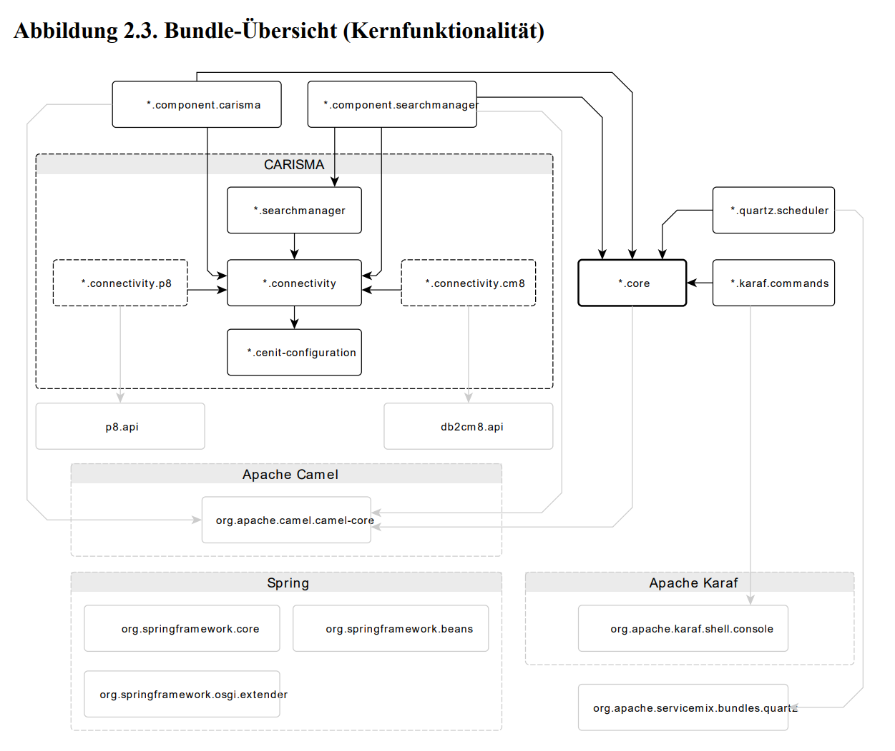

# CENIT Servicemanager
## Integrationsplattform (Basis-Komponente)
setzt [enterprise Integration Patterns (EIP)](/EIP_Enterprise_Integration_Patterns.md) um

## Architektur
### Technologien 
- Servicemanager
    - [Quartz](Quartz.md)
    - [Spring](Spring.md)

- [Apache Karaf](/Apache_Karaf.md)
    - [OSGi](OSGi.md)
    - [OSGi Blueprint](OSGi_Blueprint.md)
        - [Apache Aries](Apache_Aries.md)

- [Apache Camel](/Apache_Camel.md)
    - [Spring](Spring.md)

- [CARISMA](Carisma.md)
    - [CENIT Content Framework](CENIT_Content_Framework.md)
    - [CENIT Searchmanager](CENIT_Searchmanager.md)

unterstützt allerdings nur [Apache Felix](Apache_Felix.md) als **OSGi Container**

### Starten von SM
C:\ServiceManager\servicemanager-4.4.3-202406171825\bin
 - open console and run ./start.bat
- open http://servicemanager-host:8181 Url (localhost)