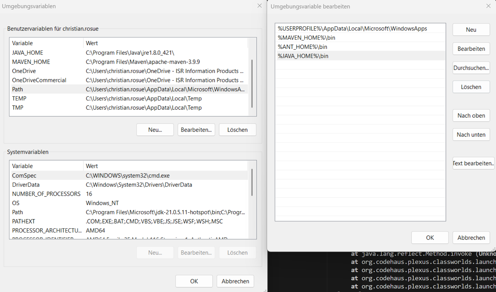
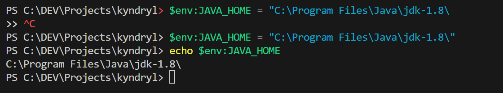

## Set User Env Windows



## Set Environment Variables for certain java version (project based)
(powershell) Bsp: JDK 8
```$env:JAVA_HOME = "C:\Program Files\Java\jdk-1.8\"```

### Verify that the environment variable is set correctly by running:
(powershell)
```echo $env:JAVA_HOME```

