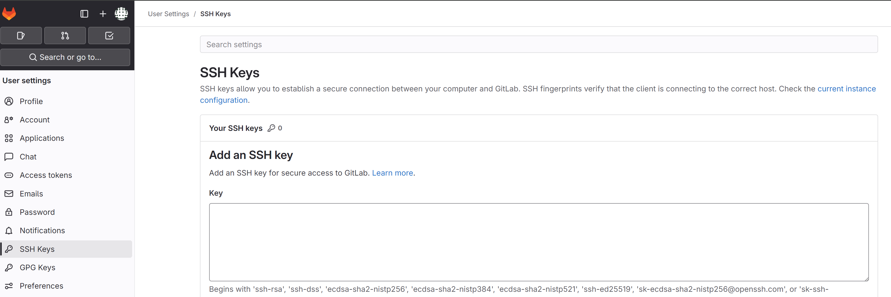
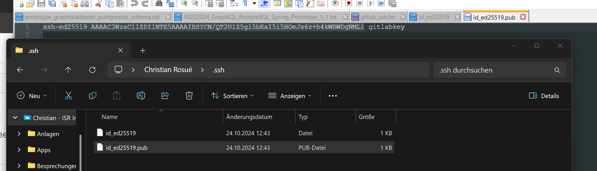

# GitLab SSH
https://docs.gitlab.com/17.4/ee/user/ssh.html

### check for existing key pair
Go to your home directory.
Go to the .ssh/ subdirectory.

### Generate SSH key pair
For example, for [ED25519](https://medium.com/@sahil-awasthi/all-about-ed25519-edffd38a4874#:~:text=2%20min%20read,digital%20signature%20generation%20and%20verification.):

``` ssh-keygen -t ed25519 -C "<comment>" ```

Your identification has been saved in C:\Users\christian.rosue/.ssh/id_ed25519

Your public key has been saved in C:\Users\christian.rosue/.ssh/id_ed25519.pub


