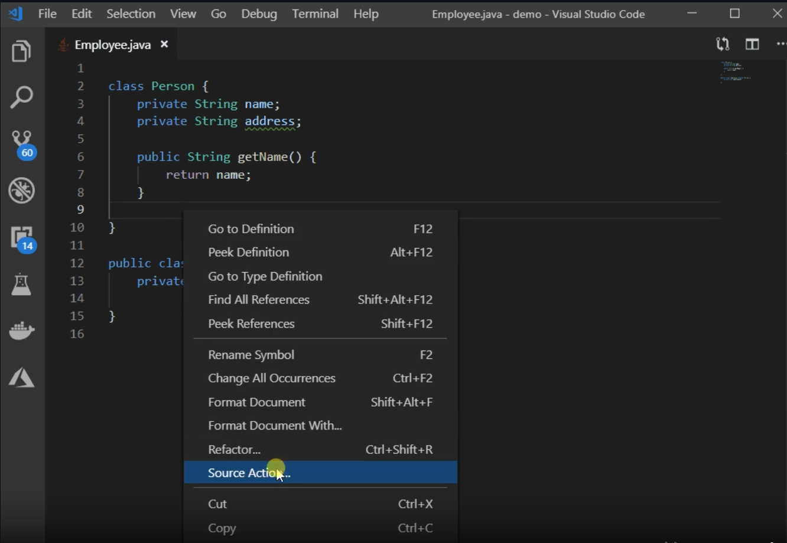

## VSCode Markdown
switch between **views** press ```Ctrl+Shift+V```


## (Auto generated) Getters & Setters
#### Documentation:
https://code.visualstudio.com/docs/java/java-refactoring


## open folder from powershell
```Start-Process -WindowStyle Hidden code . ```